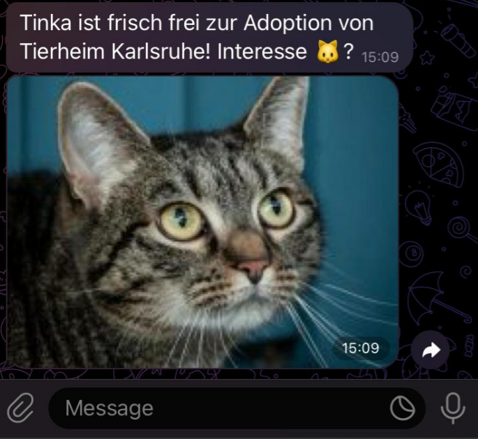

# Cat Adoption Alert

### Script for scraping different animal shelters for the cats currently up for adoption. Changes are reported via a Telegram bot to curated list of recipients.

Requirements are managed with [poetry](https://python-poetry.org/).

Populate secrets.yaml and recipients as neccessary.

To extend list of shelters, inherit AbstractShelter, set name and url and implement the get_cats() method.

Localization is not implemented, but as simple as keeping track of recipient language and editing a few string templates. 

